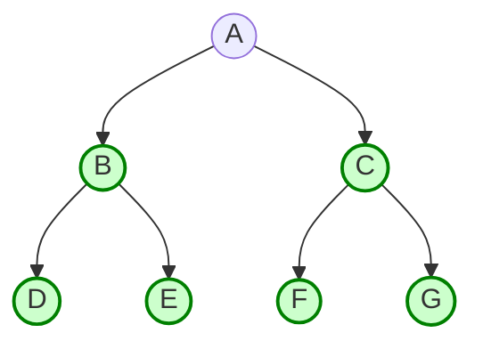
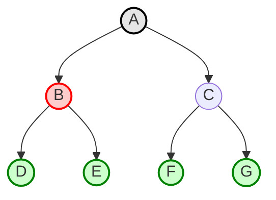
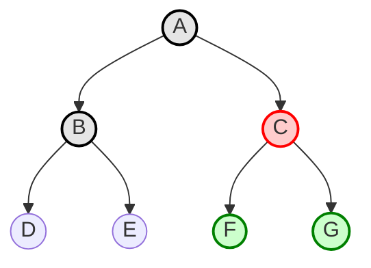
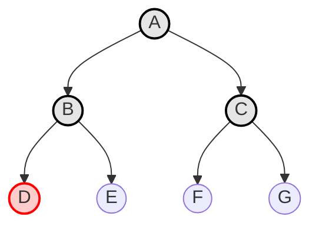

Espandere il nodo non espanso più superficiale

## Inplementation
fringe is a FIFO queue, i.e., new successors go at end

![[Pasted image 20250218202558.png]]

![[Pasted image 20250218203312.png]]

![[Pasted image 20250218202638.png]]

![[Pasted image 20250218202648.png]]

## Proprietà

Completo? Sì (se b è finito)[[Time and Space Complexity]]
Tempo? 1 + b + b^2 + b^3 + . . . +b^d + b(b^d - 1) = O(b^d+1), cioè esponensiale in d
Spazio? O(b^d+1) (mantiene ogni nodo in memoria)
Ottimale? Sì (se il costo = 1 per passo); non è ottimale in generale.

Lo spazio è il grande problema; si possono facilmente generare nodi a 100MB/sec quindi 24 ore = 8640 GB.